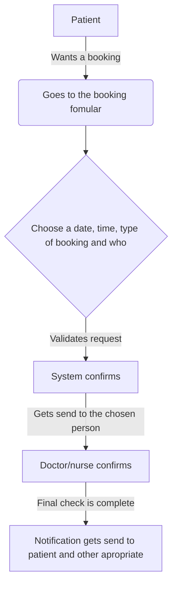

# SPECHealtcareBooking

## About the project
Making a platform where you/patient can book a consulation or other types of meetings with a doctor/nurse. the system checks for availability and checks the first of two bookings checks. When the first check is there. the booking gets sent to the apropiate doctor/nurse, who will then confirm themselv and then the booking is final. When the booking is final, both the patient and the doctor/nurse will revice a notification. 

## Overview

## Tech stack
Make table

Language: C# (.NET), Typescript (React)
Projects:
- Restful web api
- Class library 
DB: PostgreSQL
DB manager: Beekeeper studio
DB structure decisions: TPT (Table per Type), one base table that subtables inherent from
Data generation: Faker (bogus)
